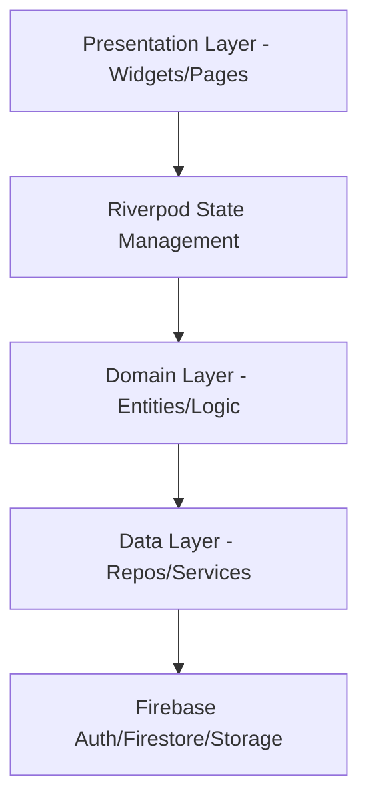

# 🌿 Crono Swap: The Decentralized Skill Exchange

Crono Swap is a premium, gamified platform designed to facilitate peer-to-peer skill sharing. Instead of traditional currency, users exchange their most valuable asset: **Time**. 

Built with a focus on "time-balance," the platform ensures fair value exchange while fostering a community of continuous learners and mentors.

---

## 🚀 Key Features

### 🕒 Time-Balance Economy
- **Crono Hours**: A unique internal currency where 1 Credit = 1 Hour of teaching/learning.
- **Fair Exchange**: Users earn credits by teaching others and spend them to learn new skills.
- **Atomic Transactions**: All credit transfers are handled via Firestore transactions to ensure data integrity and prevent double-spending.

### 🎮 Gamification Engine
- **XP & Leveling**: Users earn experience points (XP) for every interaction (swaps, reviews, lectures).
- **Progression System**: Unlock custom titles (e.g., Novice, Expert, Master) as you level up.
- **Achievement Badges**: Earn visual badges for milestones like "First Swap," "Top Reviewer," and "Knowledge Guru."
- **Global Leaderboard**: Compete with the community and see who's contributing the most value.

### 📚 Learning Management (Lectures)
- **On-Demand Content**: Providers can upload structured lectures (videos, documents, links).
- **Enrollment**: Students can "buy" access to permanent learning materials using their Crono credits.
- **Rating System**: High-quality content is promoted through a robust peer-review mechanism.

### 📝 Smart Resume Builder
- **Auto-Generated Experience**: The platform tracks every teaching and learning interaction.
- **Professional Export**: Generate a shareable summary of your "Real World" experience gained through the platform.
- **Verified Skills**: Employers can see actual feedback and hours logged for specific skills.

### 💬 Real-Time Coordination
- **Integrated Chat**: Seamless communication between mentors and learners.
- **Swap Requests**: Intuitive workflow for proposing, accepting, and completing skill swaps.

### 🛡️ Admin Dashboard
- **User Management**: Tools to monitor, activate, or suspend accounts.
- **Content Governance**: Review reported sessions and manage global lecture listings.
- **Global Configuration**: Admins can adjust XP multipliers, default credit allocations, and system-wide settings.

---

## 🏗️ Technical Architecture

The project follows **Clean Architecture** principles to ensure scalability and maintainability.



### Stack
- **Frontend**: [Flutter](https://flutter.dev/) (Material 3)
- **State Management**: [Riverpod](https://riverpod.dev/) with Code Generation
- **Backend (BaaS)**: [Firebase](https://firebase.google.com/)
- **Database**: Cloud Firestore (Atomic Transactions)
- **Storage**: Firebase Storage (Media Assets)
- **Design System**: Custom "Forest Green" theme with [Google Fonts (Outfit)](https://fonts.google.com/specimen/Outfit)

---

## 📁 Project Structure

```text
lib/
├── core/               # Shared utilities, theme, and global services
│   ├── services/       # Gamification, Notifications, Badge logic
│   └── theme.dart      # Design system & color tokens
├── features/           # Feature-driven modules
│   └── skill_exchange/
│       ├── data/       # Repositories & Models
│       ├── domain/     # Entities
│       └── presentation/ # UI (Pages, Providers, Widgets)
└── main.dart           # App entry point
```

---

## 🛠️ Getting Started

### Prerequisites
- Flutter SDK (v3.11.0 or higher)
- Firebase Account & Project

### Setup
1. **Clone the repository**:
   ```bash
   git clone [repository-url]
   ```
2. **Install dependencies**:
   ```bash
   flutter pub get
   ```
3. **Configure Firebase**:
   - Add your `google-services.json` (Android) and `GoogleService-Info.plist` (iOS) to the respective directories.
   - Run `flutterfire configure` to update `firebase_options.dart`.
4. **Run the app**:
   ```bash
   flutter run
   ```

---

## 🎨 Design Philosophy
Crono Swap uses a **Modern Forest Green** palette, symbolizing growth and organic community building.
- **Primary**: `#2D6A4F` (Forest Green)
- **Accent**: `#74C69D` (Soft Mint)
- **Typography**: Outfit (Geometric Sans Serif) for a clean, professional look.

---

## 📄 License
This project is for internal use/development. See `LICENSE` for details (if applicable).
